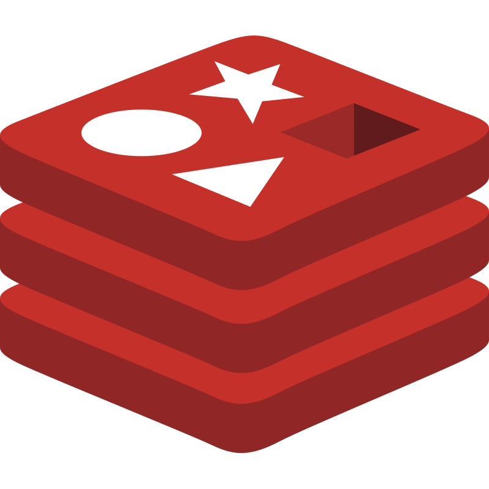

# **Liberate your data with Redis Streams and Golang**

🧛‍♂️ Open Conf 2024! 😎

---
# **Who Am I?** 


---
# **What we will cover**

* What are streams
* Redis Streams features
* How to produce data
* How to consumer data from one/many streams
* How to consumer data with consumer groups

---
# **What are streams**

A [stream](https://en.wikipedia.org/wiki/Stream_(computing)) is a sequence of data elements(i.e.series of strings, JSON, binary, raw bytes) that are made available for processing in small chunks over time

---
# *Redis Streams* 

* Redis Streams is a simple, and yet powerful data structure for managing data streams. 
* The data structure is built into Redis.
* Redis Streams creates a data channel that connects producers and variety of consumers with different data needs.
* It is available since version 5.0 of [Redis](https://redis.io/)

---
# **Benefits of Redis Streams**
* Communicate between producers and consumers asynchronously
* Effectively manage consumption of data, event when producer and consumers don't operate in the same rate 
* Scale-out the number of consumers
* Implement transaction-like data safety when consumers fail while consuming data

---
# Where to use 
* **Messaging**: Connect producers and one or more similar consumers
* **μServices**: Multiple μServices consuming the same data for different purposes
* **Image Processing**: Scaling out consumers to catchup with the production rate
* **Artificial Intelligense**: Many producers and consumers with different data needs
--- 

# **Tools to use for this tutorial**
* [Redis](https://redis.io)
* [Redis Streams](https://redis.io/docs/latest/develop/data-types/streams/)
* [Golang](https://go.dev)
* [Golang Redis client](https://redis.uptrace.dev)
* [Go Typed Redis Streams](https://github.com/dranikpg/gtrs)
* [Docker](https://www.docker.com)
---
# **Where to find the code**

```shell
git clone https://github.com/pliakas/redis-streams-with-go
```
---
# **Adding data to a stream**

The default method for adding adding data
```shell
XADD [stream name] [id] [key] [data]
```
Example: 
```shell

# Just add some data
XADD mystream * city Athens temperature 30

#  Adding data with a maximum limit
XADD mystream MAXLEN 1000 * city Athens temperature 30

#  Adding data specific key
XADD mystream 10000000 city Athens temperature 42
```
---
# Let's code a producer  


---

# **Consuming data from the stream** 
---

# **Reading data**
```shell
READ BLOCK [milliseconds or 0] STREAMS [stream name]
```

Example 
```shell
# Read everything from the beginning
XREAD COUNT 100 STREAMS mystream 0

# Read everything from a point of a stream 
XREAD COUNT 100 STREAMS mystream 1518951481323-1
```
---

# **Consume data asynchronously**
```shell
READ BLOCK [milliseconds or 0] STREAMS [stream name]
```

Example
```shell
# Consume data asynchronously (blocking call) 
XREAD BLOCK 0 STREAMS mystream 1518951123456-1 # this blocks indefinitely 

# Read only new data as it arrives
XREAD BLOCK 60000 STREAMS mystream $
```
---

# **Let's code a consumer**


---
# **Consuming data from the stream via consumer group**
---
# **Create a consumer group**

```shell
XGROUP CREATE [stream name] [group name] $ [MKSTREAM]
```

Example
```shell
XGROUP CREATE mystream mygroup $ MKSTREAM
```
---

# **Read from a consumer group**

```shell
XREADGROUP GROUP [group name] COUNT [n] [consumer name] STREAMS [stream name] >
```
Example: 
````shell
XREADGROUP GROUP mygroup COUNT 30 consumer-one STREAMS mystream >
````
---
# **Acknowledge after reading**
```shell
XACK [stream name] [group name] [id]
```
Example:
````shell
XACK mystream mygroup 1526569411111-0
````
---

# **Let's code a consumer-group**


---

# **Further actions (Homework)**
* Iterate the stream to read past data
* Find the messages in the pending list - consumed but not acknoledge 
* Claim pending messages from another consumer

---
# **Resources**
* [Golang Redis client](https://redis.uptrace.dev)
* [Go Typed Redis Streams](https://github.com/dranikpg/gtrs)
* [Redis Commands Cheat sheet](https://redis.io/learn/howtos/quick-start/cheat-sheet)
* [Getting started with Redis Streams (Data sheet)](https://redislabs.com/wp-content/uploads/2021/08/DS-Redis-Streams.pdf)
--- 
# **Questions/Discussion**
---
# **Thank you**


---
<!-- Add this anywhere in your Markdown file -->
<script type="module">
  import mermaid from 'https://cdn.jsdelivr.net/npm/mermaid@10/dist/mermaid.esm.min.mjs';
  mermaid.initialize({ startOnLoad: true });
</script>